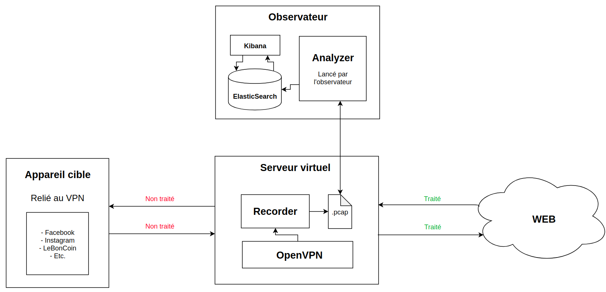

# Sniffit-py

L'objectif de ce projet était de fournir les outils nécessaires à l'étude du traffic internet de notre vie courante afin d'être utilisés lors de problématiques liées au Edge Computing

# Table des matières

1. [ Portée du projet ](#portee-du-projet)
2. [ Solutions non retenues ](#solutions-non-retenues)
3. [ Solution retenue ](#solution-retenue)
4. [ Architecture de la solution ](#architecture-de-la-solution)
5. [ État des lieux ](#etat-des-lieux)
6. [ Evolutions envisageables ](#evolutions-envisageables)
7. [ Installation ](#installation)
8. [ Utilisation ](#utilisation)
9. [ Exemples de données obtenus ](#exemples-de-données-obtenus)

<a name="portee-du-projet"></a>

# Portée du projet

Afin de fournir une solution fonctionnelle en un temps assez court, la portée du projet a été limitée aux paquets TCP et UDP. La solution fournie devaient également être le moins intrusive possible.

## Exemple d'applications qui peuvent être étudiées

- Youtube
- Netlix
- Spotify
- Deezer
- Waze
- Google Maps
- Messengers (What'sapp, Gmail/Outlook ...)
- Réseaux sociaux (Instagram, Twitter ...)

<a name="solutions-non-retenues"></a>

# Solutions non retenues

## Mitmproxy

Mitmproxy permet la mise en place d'un proxy transparent. En installant un certificat particulier sur la machine cliente, il était alors possible d'analyser facilement et de manière détaillée tout le traffic passant sur ce proxy.

### Avantages :

- Analyse simple
- Analyse détaillée et bien segmentée (on sait précisément quelle requête https donne lieu à quel payload)

### Inconvénients :

- Intrusif
- Machine-dependent (requiert l'installation d'un certification sur chaque machine)
- Faible, voire complétement inutlisable, face au Certificate Pinning
  - Les applications natives s'assurent désormais qu'aucun certificat n'a été introduit afin d'éviter les attaques Man-In-The-Middle. Cette sécurité est contournable en décompilant le code de l'application, en extrayant le morceau de code responsable du pinning, puis en recompilant l'application
  - Application-dependent

## VPN sniffé avec Libtins

Libtins est un wrapper autour de libpcap permettant d'analyser le traffic entrant et sortant d'une machine. Écrite en C++, la librairie se décrit comme presque aussi performant que libpcap, avec des fonctionnalités en plus.

### Avantages :

- Performant
- Maîtrises de nombreux aspects du sniffing

### Désavantages :

- Langage que nous avons peu utilisé pour le moment
- Bas niveau nécessitant d'être prêt à mettre les mains dans le cambouis
- Documentation peu accessible, peu vulgarisée

<a name="solution-retenue"></a>

# Solution retenue

## VPN sniffé avec PyShark

PyShark est une librairie se basant sur TShark. En lançant un processus TShark, la librairie récupère le contenu du traffic circulant sur la machine et l'encapsule dans des classes haut niveau.

### Avantages :

- Haut niveau facilitant l'utilisation de la librairie
- Python

### Désavantages :

- De base, récupère et écrit dans des fichiers pcap énormément de données
- Documentation seulement partielle
  - _To easily view the different attributes of the layer, you can simply run dir(packet.my_layer)_, source : http://kiminewt.github.io/pyshark/

<a name="architecture-de-la-solution"></a>

# Architecture de la solution



## Recorder

Responsable de la capture du traffic, ce script minimaliste stocke les données dans un fichier pcap utilisable à posteriori

Le traffic est volontairement stocké dans un fichier plutôt qu'être analysé à la volée afin d'éviter la surcharge de notre VPS disposant de peu de ressources déjà bien mises à mal avec le VPN.

## Analyzer

Responsable de l'analyse du traffic. L'analyzer vient parcourir les packets enregistrés et viens stocker les informations intéressantes (taille du payload, timestamp) dans le stream correspondant.

Les écarts entre chaque packets sont analysés et une moyenne est réalisée.

Si le temps entre deux packets dépasse l'écart moyen calculé pour ce stream, alors son contenu est flush vers la base de données. Le même processus se produit également si le stream n'est pas fermé à la fin de l'exécution du script.

## ElasticSearch et Kibana

L'utilisation de ElasticSearch permet une bonne scalabilité à moindre coût. En fournissant des agrégations rapides, il permet une analyse performante des données. De plus, Kibana fournit énormément de représentation toutes faites telles que les représentations Timelion ou TSVB pour les données time series.

Ces deux composants peuvent être déployés rapidement grâce à docker et docker-compose

<a name="etat-des-lieux"></a>

# État des lieux

## Recorder

- Enregistrement du flux **Serveur -> VPN** et **VPN -> Serveur**
  - Packet **TCP**, **UDP** ou les deux
  - Filtre sur les autres flux possibles (Tunnel SSH, etc.)

## Analyzer

- Analyse possible selon 2 modes :
  - **Paquets :** Envoi des informations de chaque paquet directement à Kibana
  - **Streams :**
    - Récupération des informations
    - Calcul d'une moyenne d'interval de temps entre les paquets
    - Regroupement des paquets en stream à partir de cette moyenne
    - Récupération des noms d'hôtes à l'aide de requêtes reverse-DNS
    - Flush vers la base de données

<a name="etat-des-lieux"></a>

# Evolutions envisageables

## Recorder

- Etendre les protocoles supportés
- Permettre aisément le record de plusieurs clients

## Analyzer

- Améliorer le système de regroupement des paquets en stream pour tendre vers la meilleure solution possible
- Faire des batchs pour l'envoi des données vers Elastic Search
- Fournir la possibilité de sortir les données autrement (JSON, CSV, ...)

<a name="installation"></a>

# Installation

## OpenVPN

### Via Docker

Pour installer OpenVPN, il suffit d'exécuter la commande suivante dans le dossier `openvpn` :

```shell
docker-compose up -d
```

### En local

[Suivre ce lien](https://openvpn.net/vpn-server-resources/installing-openvpn-access-server-on-a-linux-system)

### Connexion au VPN

Une fois OpenVPN Access Server lancé, vous pouvez ajouter un utilisateur via interface web admin au port `943`

#### Identifiants admin :

Login : `admin`

Password : `password`

Une fois ajouté, il suffit de connecter votre device en utilisant l'application OpenVPN, accès de type _Access Server_.

## ElasticSearch / Kibana

### Via docker

Pour la stack EK, il suffit d'exécuter la commande suivante dans le dossier `elasticsearch` :

```shell
docker-compose up -d
```

### En local

[Suivre ce lien](https://www.elastic.co/guide/en/elastic-stack/current/installing-elastic-stack.html)

## Dépendances python

```shell
apt-get update && apt-get install -y python3-pip \
    tshark \
    && pip3 --no-cache-dir install -r requirements.txt
```

Librairies python installées :

- elasticsearch (7.1.0)
- pyshark (0.4.2.9)
- python-dotenv (0.10.3)

## Sniffer

Maintenant que les dépendances sont en place, il suffit de configurer le sniffer en mettant à jour les variables d'environnement du fichier `.env`.

Ces variables permettront de ne pas enregistrer les échanges marqués comme 'Non traité' sur le schéma.

- `IP_CLIENT` -> Adresse IPV4 de l'appareil à enregistrer
- `IPV6_CLIENT` -> Adresse IPV6 de l'appareil à enregistrer
- `IP_SSH` -> Adresse IPV4 de l'appareil en tunnel SSH jusqu'au VPN (si connecté à la machine distante)
- `IPV6_SSH` -> Adresse IPV6 de l'appareil en tunnel SSH jusqu'au VPN (si connecté à la machine distante)
- `IP_VPN` -> Adresse IPV4 du server OpenVPN
- `IPV6_VPN` -> Adresse IPV6 du server OpenVPN
- `IP_ES` -> Adresse IP du server ElasticSearch
- `PORT_ES` -> Port du serveur ElasticSearch

Si aucun VPN n'est utilisé, il est toujours possible d'utiliser le projet en ne donnant pas de valeur aux variables suivantes :

- `IP_CLIENT`
- `IPV6_CLIENT`
- `IP_SSH`
- `IPV6_SSH`

Et en mettant votre ip/ipv6 dans les variables `IP_VPN`, `IPV6_VPN`.

<a name="utilisation"></a>

# Utilisation

## Recorder

Pour lancer le recorder, utiliser la commande suivante :

```shell
python3 src/recorder.py
```

### Paramètres

| Paramètre   | Short |  Type  |                   Description                   |      Défaut |
| ----------- | :---: | :----: | :---------------------------------------------: | ----------: |
| --output    |  -o   | String |  Nom du fichier sortant dans /capture (.pcap)   |     capture |
| --time      |  -t   |  Int   |       Temps d'enregistrement du recorder        | En continue |
| --protocol  |  -p   | String | Type de protocol à enregistrer [udp, tcp, both] |         tcp |
| --interface |  -i   | String |              Interface de capture               |        eth0 |

## Analyzer

Après avoir récupéré le fichier .pcap sortant du recorder, lancer l'analyse avec la commande suivante :

```shell
python3 src/analyzer.py
```

### Paramètres

| Paramètre | Short |  Type  |                 Description                  |  Défaut |
| --------- | :---: | :----: | :------------------------------------------: | ------: |
| --input   |  -i   | String | Nom du fichier présent dans /capture (.pcap) | capture |
| --mode    |  -m   | String |      Méthode d'analyse [packet, stream]      |  stream |

## Kibana

`TODO`

<a name="evolutions-envisageables"></a>

# Exemples de données obtenus

`TODO UNE IMAGE`
